<div align="center">



<br/>


<br/>

[](https://www.linkedin.com/in/bhuwanjoshi-np/)
[](https://www.joshibhuwan.com.np/)
[](mailto:bhuwanj766@gmail.com)

</div>

<br/>

```bash
$ cat about.md
```

I build end-to-end products across web, mobile, and computer vision — from
customer-facing apps to internal automation systems that run unattended in
production. I move fast with AI-assisted workflows, and I go just as deep
when it matters: debugging 3D transform math, fixing production incidents
under real traffic, and designing system architecture from a blank page.

Based in Kathmandu, Nepal.

<br/>

```bash
$ cat stack.json
```

```json
{
  "languages":  ["TypeScript", "JavaScript", "Python", "PHP", "C++"],
  "frontend":   ["React", "React Native (Expo)", "Next.js", "Tailwind CSS", "Framer Motion", "Zustand", "TanStack Query"],
  "backend":    ["Node.js", "Express", "Fastify", "FastAPI", "REST API design"],
  "data":       ["PostgreSQL", "MongoDB", "Firebase", "Redis", "SQLite", "Prisma", "Drizzle ORM"],
  "ai_ml_cv":   ["PyTorch", "3D pose & avatar reconstruction", "RAG / hybrid retrieval", "LLM integration (Gemini, Groq, local models)"],
  "systems":    ["WebRTC (mediasoup SFU)", "Docker", "systemd", "MQTT", "GitHub Actions CI"],
  "testing":    ["Vitest", "Jest", "Playwright"]
}
```

<div align="center">


</div>

<br/>

```bash
$ ls ./experience
```

**Development Intern — RAIN, Sunway College Kathmandu**  ·  *Jan 2026 – Present*
Building a cross-platform floor-booking system for the college end-to-end:
React Native (Expo) + TypeScript on mobile, Node.js backend, Firebase
Auth/Firestore, push notifications, and 2FA — 80+ commits shipping features
across mobile, web, and backend.

**Software Development Intern — Prateek Innovations**  ·  *2026 – Present*
Working across a production React/Node stack. Recent work: fixed a file-
upload crash in a media pipeline, patched a Node runtime compatibility issue
in a realtime service, hardened server startup against a database-outage
crash loop, and shipped a new product showcase page.

<br/>

```bash
$ tree ./featured-work -L 1
```

```
featured-work/
├── nepali-sign-language-pipeline/   computer vision: video -> 3D avatar
├── autonomous-content-pipeline/     LLM-planned, code-rendered daily video system
├── realtime-video-calling/          self-built WebRTC SFU for calls + recording
├── offline-legal-assistant/          hybrid-retrieval RAG with its own eval harness
├── ua-hackathon-2026/                i18n email validation (public)
└── whatsapp-ai-bot/                  event-driven WhatsApp automation (public)
```

**Nepali Sign Language 3D Avatar Pipeline** — Fuses three pretrained
computer-vision models (whole-body 3D pose estimation, 2D pose verification,
and dedicated hand-detail reconstruction) with confidence-gated fallback to
turn monocular sign-language video into rigged 3D avatars, plus a trained
recognition model to go the other direction. Includes a full-stack mobile
app (translate / create / practice) with end-to-end tests. *(private)*

**Autonomous Content Pipeline** — A fully unattended daily video pipeline:
an LLM plans the content, the actual video is rendered frame-by-frame from
code (procedural animation + physics simulation, not generative video),
narrated with offline neural TTS, assembled and loudness-normalized with
FFmpeg, and published automatically — scheduled via systemd with a
documented fallback at every stage. *(private)*

**Real-Time Video Calling** — A self-built WebRTC SFU (Selective Forwarding
Unit) using mediasoup for multi-party video/audio calls with recording,
plus real-time chat over Socket.IO. *(private)*

**Offline Legal Assistant (RAG)** — A phase-constrained conversation engine
that keeps a small local LLM on task, backed by hybrid vector + full-text
retrieval (reciprocal-rank fusion) over real statutory text — with an
actual retrieval-quality evaluation harness measuring hit-rate and MRR, not
just a demo. *(private)*

**[UA-Hackathon-2026](https://github.com/BhuwanJoshi-01/UA-Hackathon-2026)**
— Universal-Acceptance-compliant contact form validating internationalized
email addresses (Devanagari / Arabic / Han scripts) per IDNA2008 / RFC 6531,
built for a national hackathon. React + TypeScript + Fastify, with automated
tests.

**[friday-whatsapp-ai-bot](https://github.com/BhuwanJoshi-01/friday-whatsapp-ai-bot)**
— WhatsApp automation bot with an event-bus architecture, database
repository layer, and a rate-limiting/loop-detection safety layer around
LLM-generated replies.

<br/>

```bash
$ git log --stat --author=bhuwan
```

<div align="center">


</div>

<br/>

```bash
$ cat contact.txt
```

Open to full-time and internship roles — reach out via
[LinkedIn](https://www.linkedin.com/in/bhuwanjoshi-np/), the
[portfolio contact form](https://www.joshibhuwan.com.np/), or email above.
